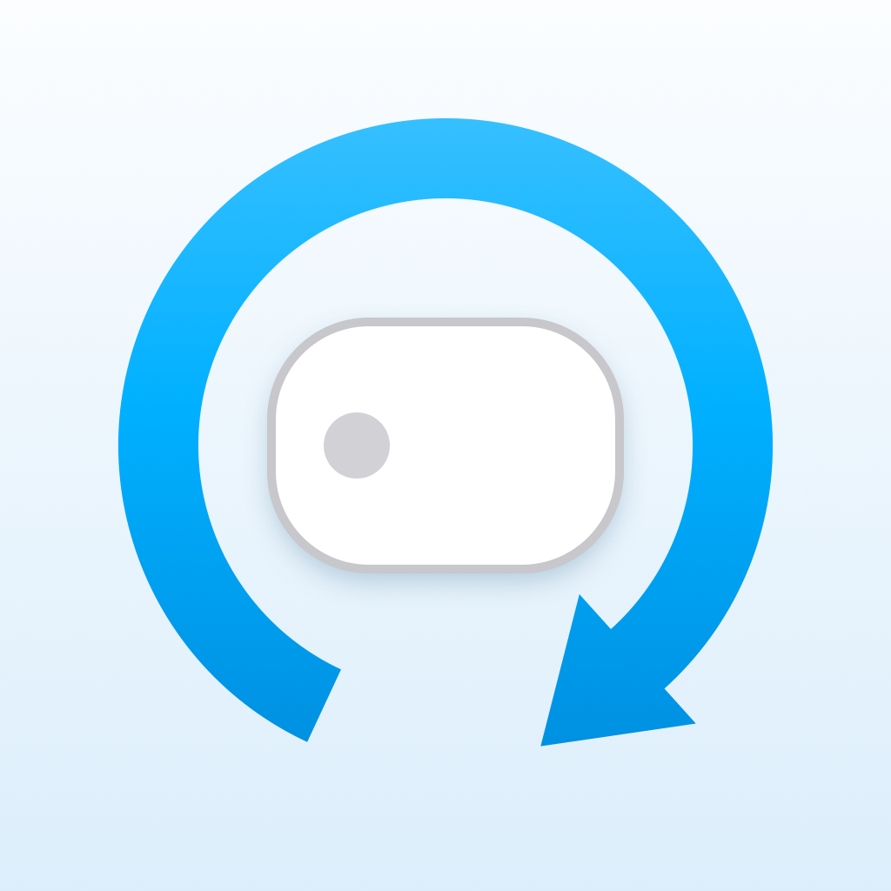
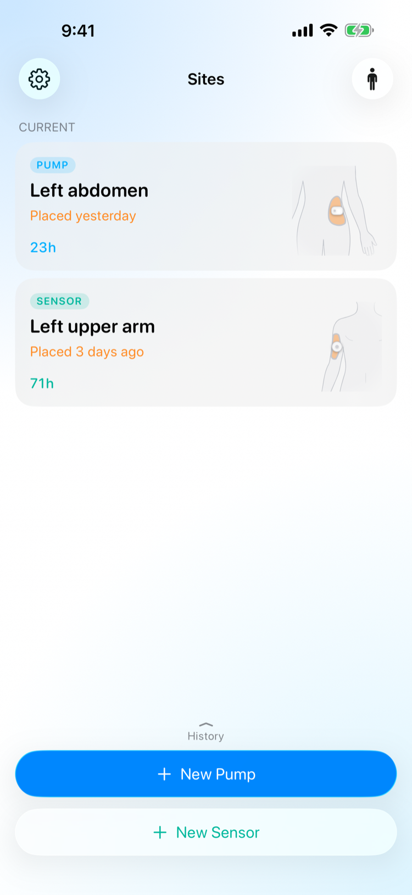
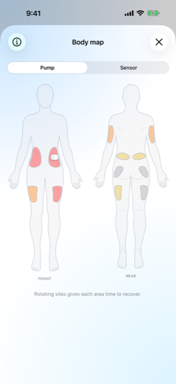
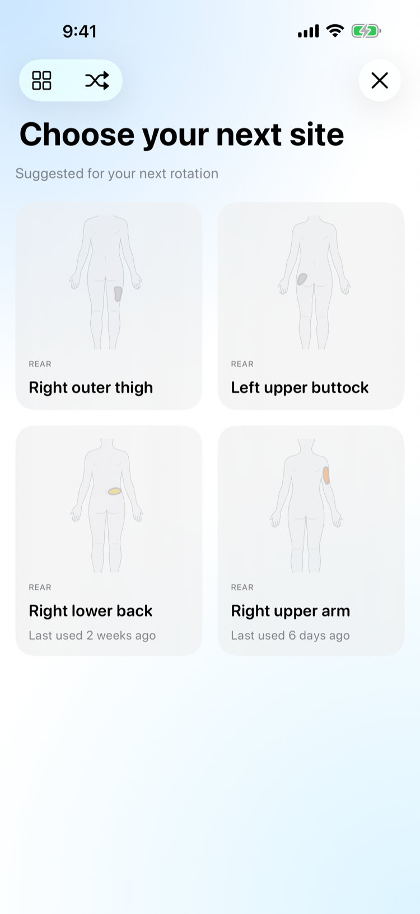

<div align="center">

<a href="https://botanica.consulting"><picture><source media="(prefers-color-scheme: dark)" srcset="docs/assets/botanica-software-labs-light.png"></picture></a>



# Rotate

**A private journal for where you place your insulin pump and CGM — and when.**

[](https://github.com/botanica-consulting/rotate/actions/workflows/ci.yml)
[](LICENSE)
[](#requirements)
[](project.yml)

</div>

**Rotate** keeps two independent rotation tracks — one for your **insulin pump**, one for
your **CGM sensor** — so each site gets the rest it needs. Log a placement in a tap or two,
watch a recency **heatmap** surface the least-used areas, and get least-recently-used,
region-diverse suggestions when it's time to move. Everything is **on-device**, synced only
through **your own private iCloud** — no account, no servers, no analytics.

Built with the DIY closed-loop community in mind: after you confirm a placement, Rotate can
hand off to [Loop](https://github.com/LoopKit/Loop) so you finish setup without hunting for it.

<div align="center">





</div>

> [!IMPORTANT]
> **Rotate is not a medical device.** It is a journaling and reminder aid. It does not read
> glucose, calculate insulin doses, diagnose skin or tissue, or communicate with your pump or
> CGM. Always follow your device's instructions and your care team's guidance for site
> selection and placement.

## Why Rotate

- **Two tracks, kept apart.** Pump and sensor each have their own sites, current marker, and
  recency coloring — no mixing the two.
- **A heatmap, not a spreadsheet.** Recent sites glow warm and least-used areas stay cool on a
  front/rear body map, so the next good spot is obvious at a glance.
- **Suggestions that actually rotate.** A deterministic least-recently-used, region-diverse
  picker proposes your next site; shuffle if you want alternatives.
- **A journal you can look back over.** Every placement is timestamped, with an at-a-glance
  "on since" / duration for each entry.
- **Private by design.** SwiftData on-device, mirrored to your private CloudKit database. No
  iCloud account? It simply stays on your iPhone, eligible for your normal encrypted backup.
- **Yours to shape.** Pick which areas each track rotates through, and a body figure that fits.

## Requirements

- **Xcode 26** (iOS 26 SDK — the UI uses native Liquid Glass APIs)
- **[XcodeGen](https://github.com/yonaskolb/XcodeGen)** — `brew install xcodegen`
- To build for a device or TestFlight: an Apple Developer team with the iCloud (CloudKit)
  capability. The Simulator needs none of this.

## Build

The `.xcodeproj` and `Info.plist` are generated from `project.yml` and are **not** committed —
generate them first:

```sh
xcodegen generate
open InsulinPumpSiteJournal.xcodeproj
```

Or drive it from the command line:

```sh
xcodebuild -project InsulinPumpSiteJournal.xcodeproj \
  -scheme InsulinPumpSiteJournal \
  -destination 'platform=iOS Simulator,name=iPhone 17 Pro' \
  build

# Unit + UI tests (the visual-QA walks are excluded from the default plan)
xcodebuild -project InsulinPumpSiteJournal.xcodeproj \
  -scheme InsulinPumpSiteJournal \
  -destination 'platform=iOS Simulator,name=iPhone 17 Pro' \
  test
```

See [`CONTRIBUTING.md`](CONTRIBUTING.md) for the full build, test, and release commands.

## Release & App Store (fastlane)

Everything ships from this Mac — no CI signing, no registered devices. Credentials live in
`~/.config/rotate-release.env` (never committed); see [`fastlane/Fastfile`](fastlane/Fastfile).

```sh
set -a && source ~/.config/rotate-release.env && set +a

fastlane screenshots   # regenerate App Store screenshots (6.9", 9:41 status bar)
fastlane beta          # build + upload a TestFlight build (bumps the build number only)
fastlane metadata      # push App Store text + screenshots (no binary)
fastlane release       # upload metadata + screenshots and submit for review
```

App Store listing text lives as plain files under [`fastlane/metadata/`](fastlane/metadata);
generated screenshots land in `fastlane/screenshots/`.

## iCloud sync

The SwiftData store mirrors to the user's private CloudKit database
(`iCloud.consulting.botanica.rotate`). Sync is account-scoped and automatic — no account means
the app simply stays local until one appears. CloudKit's silent pushes (the
`remote-notification` background mode) pull in changes made on other devices. Building for a
device requires a development team with the iCloud capability; with automatic signing, Xcode
provisions the container on first build.

### Deploying the schema (required after any model change)

CloudKit keeps **Development** and **Production** schemas separate. Debug builds use
Development, where SwiftData creates record types automatically; TestFlight and App Store
builds use Production, which **never** auto-creates anything. A field that exists only in
Development fails silently in released builds — no error, sync just stops.

So whenever `PlacementRecord` gains or renames a property, before shipping the build that
needs it:

1. Run a debug build and save a record. Record types and fields are created lazily, on first
   export — an empty store creates nothing.
2. CloudKit Dashboard → the container → Development → **Deploy Schema Changes…**, review the
   diff, deploy.
3. Confirm the field is listed under Production → Record Types.

The deploy is server-side, so already-installed builds pick it up without a new upload. This
is also automatable via `xcrun cktool import-schema --environment production`, which needs an
account-level CloudKit management token (not the container-scoped tokens under Tokens & Keys).

## Privacy

There is no account, no Botanica server, no analytics, and no third-party SDK — the developer
never sees your data. The journal itself *is* personal health-related data, and it is stored
locally and, while iCloud sync is on, mirrored to **your** private CloudKit database, which only
you can read. iCloud is Apple's server, so sync can be turned off (Settings → iCloud sync) to
keep everything on one device, with an option to delete the copy already in iCloud. A
`PrivacyInfo.xcprivacy` manifest ships in the app. See [`PRIVACY.md`](PRIVACY.md).

## Project layout

- `InsulinPumpSiteJournal/Models/` — `PlacementRecord` and `CustomSite` (SwiftData) plus the
  compile-time `PumpSite` catalog (12 built-in sites), `DeviceType`, `CompanionApp`, `BodyType`,
  `AreaSettings`, `CustomSiteStore`, `SyncSettings`, and `ReleaseNotes`.
- `InsulinPumpSiteJournal/Services/` — `SiteSuggestionEngine` (LRU + region-diversity picker),
  `SiteRecencyModel`, and the `SVGAreaPath` parser behind the body-map areas.
- `InsulinPumpSiteJournal/Views/` — history home, the new-placement flow (suggestions → confirm
  → Loop hand-off), the body-map heatmap, settings, and the body silhouettes.
- `InsulinPumpSiteJournal/AppIntents/` — the Siri intents (`AskSiteAgeIntent`,
  `StartPlacementIntent`) and the `AppShortcutsProvider` that gives them phrases.
- `Shared/` — compiled into both the app and the widget: the App Group, the `SiteSnapshot` the
  app publishes and the widget reads, the `WearDuration` arithmetic both use, and the
  `rotate://` deep link one composes and the other resolves.
- `RotateWidget/` — the lock-screen/home-screen widget extension. It reads the snapshot, not the
  SwiftData store, so it needs neither the store URL nor CloudKit.
- `InsulinPumpSiteJournal/Design/AppTheme.swift` — the palette, tier colors, and shared metrics.
- `assets-src/`, `scripts/` — the SVG mounting-area sources and the tools that render them and
  the app icon.
- `fastlane/`, `docs/` — the local release flow, App Store metadata, and design assets.

## License

[MIT](LICENSE) © Alon Livne. A Botanica Software Labs product.

_**Rotate** is provided free of charge and as-is — no warranty, and no liability on our part.
See the [MIT License](LICENSE) for the full terms._

<a href="https://botanica.consulting"></a>
